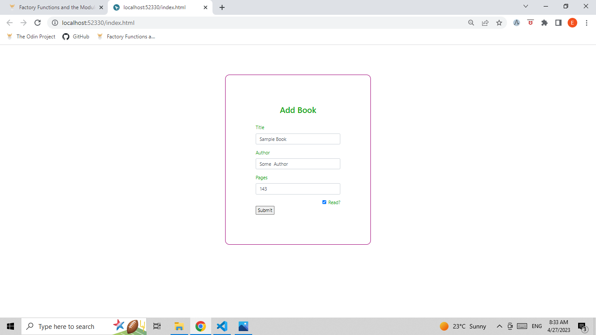
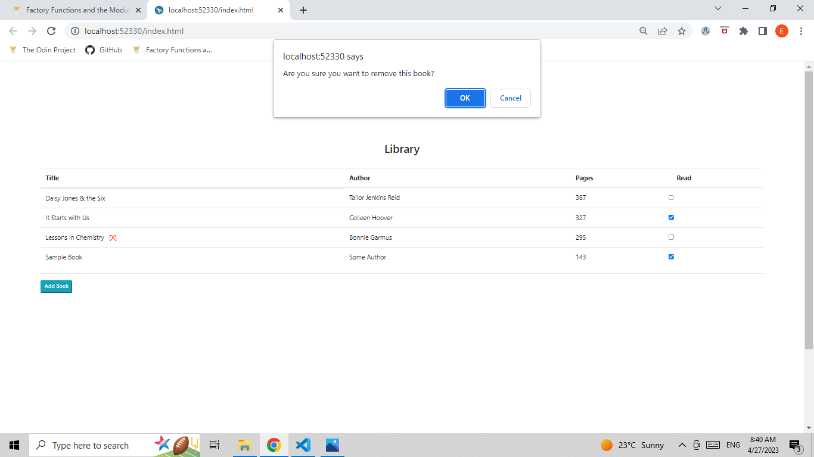

# Library

## Description
  This is a "The Odin Project" Javascript curriculum project. A virtual library which stores book information as if you added or removed a book from a real one.

## Usage
  #### Add Book
  
  #### Remove Book
  

## Js lessons covered
  - object constructors
  - object prototyping

## Note
  This is the first project from the 'TOP' Javascript course . There's so much more Js for me to learn. So, for code readabilty and orderliness, I used multiple Js file sheets for now.
